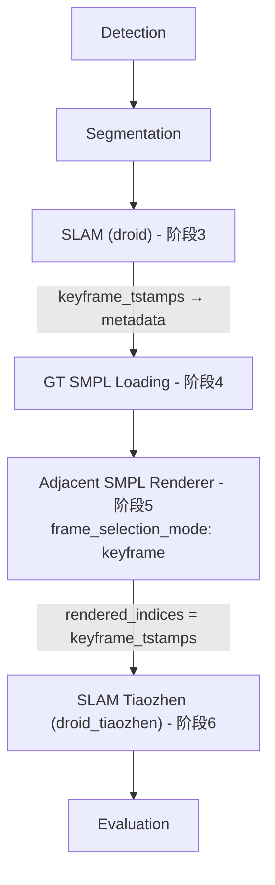

## 用户需求

新建一个 pipeline，基于现有的 `emdb_adjacent_render_gt.yaml` 进行调整。当前的 adjacent_render 使用 `pre_dis` 均匀跳跃采样帧进行渲染。新 pipeline 需要：

1. 阶段3使用 DROID-SLAM（而非 GT 相机）进行第一次 SLAM，获取关键帧信息
2. 阶段5的 `adjacent_smpl_renderer` 基于 DROID-SLAM 选出的关键帧索引来决定渲染哪些帧（而非均匀 `pre_dis` 采样），并在每个关键帧上渲染其前后 `num_adjacent_frames` 个关键帧的 SMPL 模型
3. 阶段6的 `droid_tiaozhen` 在关键帧渲染的图像上运行二次 SLAM，并将结果插值回原始帧数（适配不均匀间隔）

## 产品概述

在 DROID-SLAM 的关键帧（而非均匀采样帧）上进行相邻帧 SMPL 渲染和二次相机轨迹优化的 pipeline 变体，让渲染帧的选择更加贴合 SLAM 实际运动特征。

## 核心功能

1. 修改 `run_metric_slam` 使其返回 keyframe timestamps，将关键帧信息传递到 `data.metadata`
2. `adjacent_smpl_renderer` 新增 `frame_selection_mode` 配置，支持 `uniform`（现有行为）和 `keyframe`（使用 SLAM 关键帧索引）两种模式
3. 相邻帧偏移改为基于关键帧列表中的邻居索引（而非固定 `pre_dis` 步长）
4. `droid_tiaozhen` 的插值适配不均匀的关键帧间隔（已有逻辑基本支持，需微调元数据传递）
5. 新建配置文件和运行脚本

## 技术栈

- 语言：Python 3
- 框架：项目自有 Pipeline 架构（YAML 配置驱动的组件式流水线）
- 依赖：DROID-SLAM、PyTorch、scipy（SLERP 插值）、SMPL

## 实现方案

### 整体策略

在不破坏现有 uniform 模式的前提下，通过新增配置选项和模式分支实现 keyframe 模式。核心数据流变化：

```
DROID-SLAM (阶段3) → keyframe_tstamps 存入 data.metadata
    ↓
adjacent_smpl_renderer (阶段5) → 读取 keyframe_tstamps 作为 rendered_indices
    ↓
droid_tiaozhen (阶段6) → 使用不均匀的 rendered_indices 进行插值
```

### 关键技术决策

**1. `run_metric_slam` 返回 keyframe timestamps**

当前 `run_metric_slam` 在第 55-57 行提取了 `tstamp`（keyframe timestamps），但随后 `del droid` 导致信息丢失。修改方案：让 `run_metric_slam` 额外返回 `keyframe_tstamps`（一个 numpy 数组），即从 `(cam_r, cam_t)` 变为 `(cam_r, cam_t, keyframe_tstamps)`。

为保持向后兼容，在 `DroidSLAMBackend.estimate_camera` 中处理新返回值并透传给调用方，`SLAMComponent._execute_droid` 将其存入 `data.metadata['slam_keyframe_tstamps']`。

**2. `adjacent_smpl_renderer` 的 keyframe 模式**

新增配置项 `frame_selection_mode: 'keyframe'`（默认 `'uniform'` 保持兼容）。在 keyframe 模式下：

- 从 `data.metadata['slam_keyframe_tstamps']` 读取关键帧索引列表
- 用这些索引替代 `list(range(0, N, self.pre_dis))` 作为 `rendered_indices`
- 相邻帧偏移改为：对当前关键帧在 keyframe 列表中找前后 `num_adjacent_frames` 个邻居关键帧，而非 `offset = k * pre_dis`

**3. 插值兼容性**

`droid_tiaozhen._interpolate_camera_params` 已经通过 `rendered_indices` 列表进行逐段插值，不严格依赖均匀间隔。关键帧模式下只需确保 `adjacent_render_info` 中的 `rendered_indices` 正确传递不均匀索引即可。需要在 `adjacent_render_info` 中标记 `frame_selection_mode` 供日志和调试使用。

### 性能与可靠性

- keyframe_tstamps 是 int 数组（通常数十到数百个值），内存开销可忽略
- keyframe 模式下渲染帧数可能比 uniform 模式少（SLAM 关键帧通常比均匀采样稀疏），渲染和二次 SLAM 计算量减少
- 保持 uniform 模式完全不变，keyframe 模式通过独立分支实现，零回归风险

## 实现细节

### 向后兼容

- `run_metric_slam` 新返回值通过扩展返回元组实现。`droid_tiaozhen.py` 中的调用不受影响（它调用 `run_metric_slam` 时不需要 keyframe 信息）
- `DroidSLAMBackend.estimate_camera` 接口新增可选返回，通过在 `_execute_droid` 中特殊处理
- 现有 yaml 配置无需修改，`frame_selection_mode` 默认为 `'uniform'`

### 关键帧索引验证

- 需要验证 `slam_keyframe_tstamps` 中的索引不超过总帧数 N
- 需要确保关键帧列表排序且去重

### 元数据传递

- `adjacent_render_info` 新增 `frame_selection_mode` 和 `keyframe_indices` 字段
- `pre_dis` 在 keyframe 模式下设为 None 或计算平均间隔（供日志使用）

## 架构设计



## 目录结构

```
project-root/
├── lib/
│   ├── camera/
│   │   └── masked_droid_slam.py          # [MODIFY] run_metric_slam 新增返回 keyframe_tstamps
│   ├── pipeline/
│   │   ├── backends/slam/
│   │   │   └── droid.py                  # [MODIFY] estimate_camera 透传 keyframe_tstamps
│   │   └── components/
│   │       ├── slam.py                   # [MODIFY] _execute_droid 将 keyframe_tstamps 存入 data.metadata
│   │       └── adjacent_smpl_renderer.py # [MODIFY] 新增 frame_selection_mode='keyframe' 分支，
│   │                                     #          从 metadata 读取关键帧索引作为 rendered_indices，
│   │                                     #          相邻帧改为关键帧列表中的前后 N 个邻居
├── configs/pipelines/
│   └── emdb_adjacent_render_gt_keyframe.yaml  # [NEW] 新 pipeline 配置：阶段3用 droid，阶段5用 keyframe 模式
└── scripts/
    ├── run_adjacent_render_pipeline_gt_keyframe.sh          # [NEW] 单序列运行脚本
    ├── run_adjacent_render_pipeline_gt_keyframe_all.sh      # [NEW] 全序列运行脚本
    └── run_adjacent_render_pipeline_gt_keyframe_multigpu.sh # [NEW] 多 GPU 并行运行脚本
```

## 关键代码结构

`run_metric_slam` 返回值变更：

```python
# lib/camera/masked_droid_slam.py
def run_metric_slam(img_folder, masks=None, calib=None, is_static=False):
    # ... 现有逻辑 ...
    # 在 del droid 前保存 keyframe timestamps
    keyframe_tstamps = tstamp.copy()  # int numpy array
    del droid
    # ... 现有尺度估计逻辑 ...
    return pred_cam_r, pred_cam_t, keyframe_tstamps
```

`adjacent_smpl_renderer` 关键帧选择逻辑（execute 方法内）：

```python
# frame_selection_mode 分支
if self.frame_selection_mode == 'keyframe':
    keyframe_indices = data.metadata.get('slam_keyframe_tstamps')
    rendered_indices = sorted([idx for idx in keyframe_indices if idx < N])
else:
    rendered_indices = list(range(0, N, self.pre_dis))
```

相邻帧偏移逻辑（keyframe 模式）：

```python
# 在关键帧列表中找当前帧的邻居
pos = rendered_indices.index(i)
neighbor_indices = rendered_indices[max(0, pos - num_adj):pos + num_adj + 1]
for frame_idx in neighbor_indices:
    # 渲染该帧的 SMPL mesh
```

## Agent Extensions

### SubAgent

- **code-explorer**
- 目的：在实现过程中需要跨文件验证修改影响时，搜索 `run_metric_slam` 的所有调用点以及 `adjacent_render_info` 的所有消费者，确保改动不会引入回归
- 预期结果：确认所有调用点都正确适配新的返回值和元数据字段