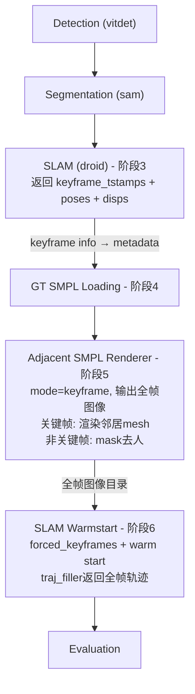
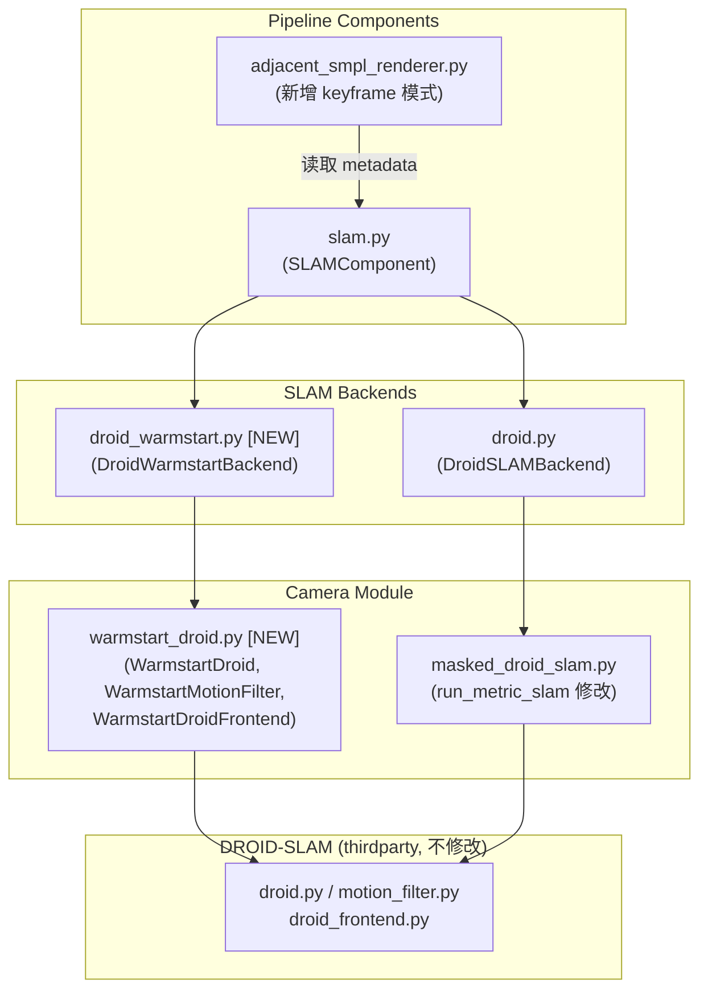

## 用户需求

基于现有的 `emdb_adjacent_render_gt.yaml` pipeline 新建一个 keyframe-based pipeline 变体。

## 产品概述

新 pipeline 使用第一次 DROID-SLAM 的关键帧信息来指导渲染和第二次 SLAM 优化，替代现有的均匀 `pre_dis` 采样。所有帧都会输出图像（关键帧上渲染邻居 SMPL mesh，非关键帧用 mask 去人），第二次 SLAM 强制使用第一次的关键帧索引并用第一次的位姿/视差做 warm start 初始化，DROID 的 `traj_filler` 直接返回所有帧的姿态，无需额外插值。

## 核心功能

1. 修改 `run_metric_slam` 使其返回 keyframe_tstamps、keyframe_poses、keyframe_disps，供下游使用
2. 在 `_execute_droid` 中将关键帧信息存入 `data.metadata`
3. `adjacent_smpl_renderer` 新增 `frame_selection_mode='keyframe'` 模式：所有帧输出图像，关键帧上渲染邻居 SMPL mesh，非关键帧用 mask 去人
4. 新建 `DroidWarmstartBackend` SLAM 后端：接受 forced_keyframes 和初始位姿，修改 MotionFilter 跳过光流筛选，禁用 frontend 关键帧移除，全帧输入直接由 traj_filler 返回全帧结果，无需插值
5. 新建 YAML 配置和运行脚本

## 技术栈

- 语言：Python 3
- 框架：项目自有 Pipeline 架构（YAML 配置驱动的组件式流水线）
- 依赖：DROID-SLAM（修改版）、PyTorch、lietorch、scipy、SMPL

## 实现方案

### 整体策略

数据流变更：



核心区别于原方案：

- 渲染器输出**所有帧**的图像（而非下采样），关键帧有 SMPL mesh，非关键帧用 mask 去人
- 第二次 SLAM 接收全帧图像，强制使用第一次的关键帧集合，用第一次的 pose/disp 做 warm start
- `traj_filler` 自然返回全帧轨迹，**不需要插值步骤**

### 关键技术决策

**1. `run_metric_slam` 返回关键帧信息**

当前 `run_metric_slam` 在第 55-57 行提取了 `tstamp` 和 `disps`，第 58 行 `del droid` 导致信息丢失。修改：在 `del droid` 前额外提取 `droid.video.poses[:n]`，并将 `keyframe_tstamps`、`keyframe_poses`、`keyframe_disps` 作为额外返回值。

为保持向后兼容，返回一个 `dict` 作为第三个返回值（可选）。现有调用点 `cam_R, cam_T = run_metric_slam(...)` 不受影响，因为 Python 的 tuple unpacking 只取前两个。但更安全的做法是添加一个 `return_keyframe_info=False` 参数：当为 False 时返回 `(cam_R, cam_T)`，为 True 时返回 `(cam_R, cam_T, keyframe_info_dict)`。

**2. MotionFilter 强制关键帧 + Warm Start**

创建新函数 `run_slam_warmstart()` 和 `run_metric_slam_warmstart()`，在 `run_slam` 基础上：

- `Droid.__init__` 中接受 `forced_keyframes: Set[int]` 和 `initial_poses: dict`
- `MotionFilter.track()` 中：当 `tstamp in forced_keyframes` 时，无条件将帧添加为关键帧（跳过光流阈值判断）。仍然执行完整的特征提取（fnet/cnet）和 `video.append()`。在 append 时，如果有 `initial_poses[tstamp]`，传入预计算的 SE3 pose 替代 `None`
- 非 forced 帧既不检查光流也不添加（直接跳过），因为我们只想要指定的关键帧
- `DroidFrontend.__update()` 中：禁用关键帧移除逻辑（第 61-77 行的 `if d.item() < self.keyframe_thresh` 分支），否则强制加入的关键帧可能被前端删除

考虑到不想污染原始 DROID-SLAM 代码，采用**继承/包装**方式：

- 不修改原始 `motion_filter.py` 和 `droid_frontend.py`
- 新建 `lib/camera/warmstart_droid.py`，包含 `WarmstartDroid` 类（继承 `Droid`），在其中替换 `filterx` 和 `frontend` 为修改版
- 新建 `WarmstartMotionFilter`（继承 `MotionFilter`），override `track()` 方法
- 新建 `WarmstartDroidFrontend`（继承 `DroidFrontend`），override `__update()` 方法禁用关键帧移除

**3. Adjacent SMPL Renderer keyframe 模式**

新增 `frame_selection_mode` 配置项（默认 `'uniform'`）。在 keyframe 模式下：

- 从 `data.metadata['slam_keyframe_info']` 读取关键帧索引
- 所有 N 帧都输出图像到 `output_dir`
- 关键帧：在该帧上渲染其在 keyframe 列表中前后 `num_adjacent_frames` 个邻居关键帧的 SMPL mesh
- 非关键帧：使用 `data.masks` 将人体区域填充为黑色（与现有 SLAM 中 `image * (img_msk < 0.5)` 一致）
- `adjacent_render_info` 新增 `frame_selection_mode` 和 `keyframe_indices` 字段

**4. DroidWarmstartBackend（新后端）**

新建 `lib/pipeline/backends/slam/droid_warmstart.py`：

- 从 `adjacent_render_info` 获取全帧图像目录
- 从 `data.metadata['slam_keyframe_info']` 获取 forced_keyframes、initial_poses、initial_disps
- 调用 `run_metric_slam_warmstart()` — 在全帧图像上跑 DROID-SLAM（forced keyframes + warm start）
- `terminate()` 中 `traj_filler` 自动返回全帧轨迹 → 直接使用，无需插值
- 保留 `align_to_world` 和 `align_scale_to_reference` 功能

**5. Warm Start 的 pose 格式转换**

第一次 SLAM 的 `run_metric_slam` 返回的是 `(cam_R [N,3,3], cam_T [N,3])` 格式（c2w，经过 metric scale 缩放）。但 DROID 内部 `video.poses` 存储的是 SE3 格式 `[tx, ty, tz, qx, qy, qz, qw]`（camera-to-world，`traj.inv()` 后的逆）。

需要做格式转换：从 `run_metric_slam` 返回的关键帧 SE3 poses（`droid.video.poses[:n]`，7 维 `[tx, ty, tz, qx, qy, qz, qw]`）直接传给 warm start，无需经过 R/T 转换。这是最干净的路径。

### 性能与可靠性

- keyframe 模式下所有帧都输出图像，渲染只在关键帧上发生（通常比全帧渲染少），非关键帧只做简单的 mask 去人操作（极快）
- 第二次 SLAM 输入全帧图像，但由于 forced keyframes 通常远少于 filter_thresh 选出的帧，MotionFilter 处理更快（跳过光流计算）
- Warm start 用第一次的 pose 初始化，BA 收敛更快
- 完全不影响现有 uniform 模式和其他 pipeline

## 实现细节

### 向后兼容

- `run_metric_slam` 默认行为不变（`return_keyframe_info=False`）
- 现有 `DroidSLAMBackend`、`DroidTiaozhenBackend` 不受影响
- 现有 YAML 配置不需要修改
- `adjacent_smpl_renderer` 的 `frame_selection_mode` 默认为 `'uniform'`

### Warm Start Droid 继承策略

由于 `DroidFrontend.__update` 和 `MotionFilter.track` 都使用了 Python name mangling（`__update` → `_DroidFrontend__update`），继承时需要特别注意：

- `WarmstartDroidFrontend` 重写 `__update` 方法（实际为 `_WarmstartDroidFrontend__update`）
- 需要同时重写 `__call__` 方法来调用新的 `__update`
- `WarmstartMotionFilter` 重写 `track` 方法（这个是公开方法，没有 name mangling 问题）

### 关键帧索引验证

- `slam_keyframe_info['keyframe_tstamps']` 中的索引必须排序且去重，且不超过总帧数 N
- warm start 的 SE3 poses 必须与 keyframe_tstamps 一一对应

### 非关键帧去人策略

使用 `data.masks` 对非关键帧进行简单的黑色填充（`img * (mask < 0.5)`），与 DROID-SLAM 中现有的 mask 处理方式保持一致。这比 inpaint 简单且足够（SLAM 本身已支持这种 mask 方式）。

## 架构设计

新增文件的模块关系：



## 目录结构

```
project-root/
├── lib/
│   ├── camera/
│   │   ├── masked_droid_slam.py       # [MODIFY] run_metric_slam 新增 return_keyframe_info 参数，
│   │   │                              #          当为 True 时额外返回 keyframe_tstamps、keyframe_poses_se3、
│   │   │                              #          keyframe_disps。在 del droid 前提取这些信息。
│   │   ├── warmstart_droid.py         # [NEW] Warm Start DROID-SLAM 封装。
│   │   │                              #   包含 WarmstartMotionFilter（继承 MotionFilter，override track
│   │   │                              #   实现 forced keyframe + pose 注入）、WarmstartDroidFrontend
│   │   │                              #   （继承 DroidFrontend，禁用关键帧移除）、WarmstartDroid
│   │   │                              #   （继承 Droid，替换 filterx/frontend 为 warmstart 版本）。
│   │   │                              #   提供 run_slam_warmstart() 和 run_metric_slam_warmstart() 函数。
│   │   └── __init__.py                # [MODIFY] 导出新函数
│   ├── pipeline/
│   │   ├── backends/slam/
│   │   │   ├── __init__.py            # [MODIFY] 导出 DroidWarmstartBackend
│   │   │   └── droid_warmstart.py     # [NEW] DroidWarmstartBackend 后端。
│   │   │                              #   从 metadata 读取 forced_keyframes 和 initial_poses，
│   │   │                              #   调用 run_metric_slam_warmstart() 在全帧图像上运行 SLAM，
│   │   │                              #   traj_filler 直接返回全帧轨迹，无需插值。
│   │   │                              #   保留 align_to_world 和 align_scale_to_reference。
│   │   └── components/
│   │       ├── slam.py                # [MODIFY] 三处修改：
│   │       │                          #   1. BACKENDS dict 新增 'droid_warmstart' 条目
│   │       │                          #   2. _execute_droid() 中将 keyframe info 存入 data.metadata
│   │       │                          #   3. 新增 _execute_warmstart() 方法处理 warmstart 后端
│   │       └── adjacent_smpl_renderer.py  # [MODIFY] 新增 frame_selection_mode 配置项。
│   │                                  #   keyframe 模式：所有帧输出图像，关键帧渲染邻居 SMPL mesh，
│   │                                  #   非关键帧用 mask 黑色填充去人。相邻帧改为 keyframe 列表中
│   │                                  #   前后 num_adjacent_frames 个邻居。
├── configs/pipelines/
│   └── emdb_adjacent_render_gt_keyframe.yaml  # [NEW] 新 pipeline 配置
└── scripts/
    ├── run_adjacent_render_pipeline_gt_keyframe.sh          # [NEW] 单序列运行脚本
    ├── run_adjacent_render_pipeline_gt_keyframe_all.sh      # [NEW] 全序列运行脚本
    └── run_adjacent_render_pipeline_gt_keyframe_multigpu.sh # [NEW] 多 GPU 并行脚本
```

## 关键代码结构

`run_metric_slam` 返回值扩展（向后兼容）：

```python
# lib/camera/masked_droid_slam.py
def run_metric_slam(img_folder, masks=None, calib=None, is_static=False, return_keyframe_info=False):
    # ... 现有逻辑 ...
    n = droid.video.counter.value
    tstamp = droid.video.tstamp.cpu().int().numpy()[:n]
    disps = droid.video.disps_up.cpu().numpy()[:n]
    # 新增：在 del droid 前提取关键帧信息
    keyframe_poses_se3 = droid.video.poses[:n].cpu().numpy()  # [n, 7] SE3
    keyframe_disps_lowres = droid.video.disps[:n].cpu().numpy()  # [n, h//8, w//8]
    del droid
    # ... 现有 ZoeDepth / scale 逻辑 ...
    if return_keyframe_info:
        return pred_cam_r, pred_cam_t, {
            'keyframe_tstamps': tstamp,        # int array, 关键帧对应的原始帧索引
            'keyframe_poses_se3': keyframe_poses_se3,  # [n, 7] SE3, 用于 warm start
            'keyframe_disps': keyframe_disps_lowres,   # [n, h//8, w//8], 用于 warm start
        }
    return pred_cam_r, pred_cam_t
```

`WarmstartMotionFilter.track` 核心逻辑：

```python
# lib/camera/warmstart_droid.py
class WarmstartMotionFilter(MotionFilter):
    def __init__(self, net, video, forced_keyframes, initial_poses_se3=None, **kwargs):
        super().__init__(net, video, **kwargs)
        self.forced_keyframes = set(forced_keyframes)  # Set[int]
        self.initial_poses_se3 = initial_poses_se3     # dict[int, ndarray[7]]

    def track(self, tstamp, image, depth=None, intrinsics=None, mask=None):
        # 特征提取（始终执行）
        # 如果 tstamp in forced_keyframes: 添加为关键帧（用 initial_pose 替代 None）
        # 否则: 跳过（不添加到 video）
```

## Agent Extensions

### SubAgent

- **code-explorer**
- 目的：在实现过程中跨文件验证修改影响，搜索 `run_metric_slam` 的所有调用点、`adjacent_render_info` 的所有消费者，以及 `__init__.py` 的导出链，确保改动不引入回归
- 预期结果：确认所有调用点兼容新的返回值，所有元数据字段正确传递